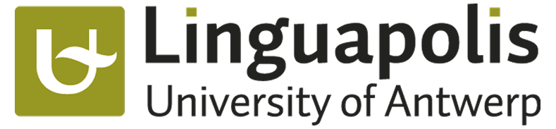

<div align="center">

# 📚 English Studying Journey

### Made by a Brazilian 🇧🇷

[](https://github.com/features/copilot)
[](https://chat.openai.com/)
[](https://claude.ai/)
[](https://www.perplexity.ai/)

</div>

Welcome to my English learning repository! This is where I document my journey from B2 to advanced English proficiency, track my progress, and organize all the resources that help me along the way.

## 🎯 About This Repository

This repository serves as:
- 📖 A comprehensive documentation of my English learning journey
- 🗂️ A centralized hub for resources, links, and study materials

## 🧑‍🎓 Starting Level

- **Starting Point:** B2 (Upper-Intermediate)
- **Start Date:** Late 2025
- **Goal:** Achieve fluency and score 6.5-7.0 on IELTS for international CS program applications
- **Native Language:** Portuguese (PT-BR)

## 🛠️ Tools & Resources

### AI Assistants
I leverage various AI tools to enhance my learning experience:

- **GitHub Copilot** - Code-based English practice and technical documentation
- **ChatGPT** - Vocabulary learning
- **Perplexity** - Research, answering questions and finding quality resources

### Traditional Resources
- 📚 Books (Cambridge English series and more)
- 🎥 YouTube videos and channels
- 🎧 Podcasts and audiobooks
- 📰 Articles and blogs
- 📱 Social media content creators
- 🎬 Movies, series, and animes

> ⚠️ **Social Media Warning:** Not all content on social media is trustworthy. Some videos spread false information, teach incorrect lessons, or present linguistic prejudice disguised as educational content. Others may be incomplete or misleading. Always verify information by doing your own research or consulting AI tools. That said, English learning content creators on social media can be incredibly helpful when used critically.

## 📚 Book Study Plan

Based on my current B2 level, I've created a structured learning path through the Cambridge English series and complementary materials.

### Phase 1: Foundation (Current)
Building solid intermediate skills and expanding vocabulary.

1. **English Grammar in Use** (Intermediate)
2. **English Vocabulary in Use** (Upper-Intermediate)

### Phase 2: Building
Developing natural English expression and understanding context.

1. **English Phrasal Verbs in Use** (Advanced)
2. **English Collocations in Use** (Intermediate)
3. **English Idioms in Use** (Intermediate)
4. **Speak English Like an American**

### Phase 3: Advanced
Mastering advanced structures and native-like expression.

1. **Advanced Grammar in Use**
2. **English Vocabulary in Use** (Advanced)
3. **English Collocations in Use** (Advanced)
4. **English Idioms in Use** (Advanced)
5. **Oxford Work Skills - Idioms and Phrasal Verbs** (Intermediate to Advanced)

## 📁 Repository Structure

```
english-studying/
├── 🎯 prompts/         # AI prompts for English learning (vocabulary, grammar, etc.)
└── 🎨 media/           # Images, logos, and visual assets
```

> **Note:** Book notes and exercises are kept privately in Samsung Notes on my tablet. Resources are documented in the sections below rather than in separate files.

## 🎓 Resources

### Online Courses

<details open>
<summary><b>Online Conversation Practice</b> - Linguapolis, University of Antwerp</summary>

<br>

<div align="center">
  
</div>

<br>

**Institution:** [Linguapolis - University of Antwerp](https://www.uantwerpen.be/en/centres/linguapolis/)  
**Status:** 🔄 On-going  
**Level:** C1+

#### My Experience

The classes are well-structured and cover a good amount of content. You're required to speak during every session—not excessively, but enough to ensure active participation. The course offers a variety of group and individual dynamics, and the tutor consistently ensures everyone gets speaking practice.

**Most Valuable Aspect:** The detailed feedback materials sent by the teacher one or two days after each session. These documents highlight what students did well and provide corrections for mistakes made during class. I've learned a significant amount of vocabulary through studying and reviewing these feedback materials.

**Key Takeaways:**
- Active speaking practice in every session
- Diverse group and individual activities
- High-quality, detailed feedback after each class
- Excellent vocabulary expansion through review materials

🔗 [Course Information](https://www.uantwerpen.be/en/centres/linguapolis/online-conversation-practice/)

</details>

---

## 💡 Study Approach

My learning philosophy:
- **Immersion:** Daily exposure to English through multiple channels
- **Active Practice:** Writing, speaking, and applying what I learn
- **AI-Enhanced:** Using technology to accelerate learning while maintaining authentic practice
- **Structured + Flexible:** Following a book plan while adapting to real-world needs
- **English-First:** All materials, notes, and practice in English

## ⚠️ Important Note

**This repository is highly personal and individualized.** The content, structure, and study plan are tailored to:
- My current English level (B2) as of late 2025
- My specific goals (IELTS preparation, international applications)
- My learning style and background
- My timeline and priorities

While you're welcome to explore and get inspired, keep in mind that your learning path should be customized to your own needs, level, and objectives.

## 🤝 Contributing

This is a personal learning repository, but if you have suggestions for resources or want to share your own learning experience, feel free to open an issue!

## 📜 License

This repository is for educational purposes. All book materials referenced are copyrighted by their respective publishers.

---

**Last Updated:** December 2025  
**Status:** 🚀 Active Learning

*"The limits of my language mean the limits of my world." - Ludwig Wittgenstein*
