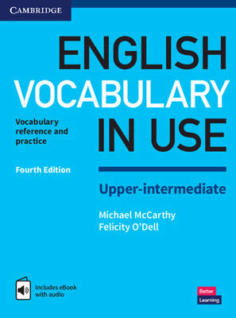
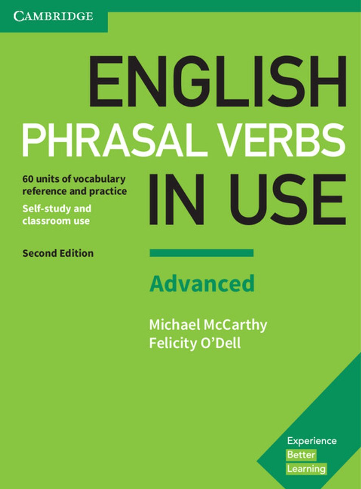
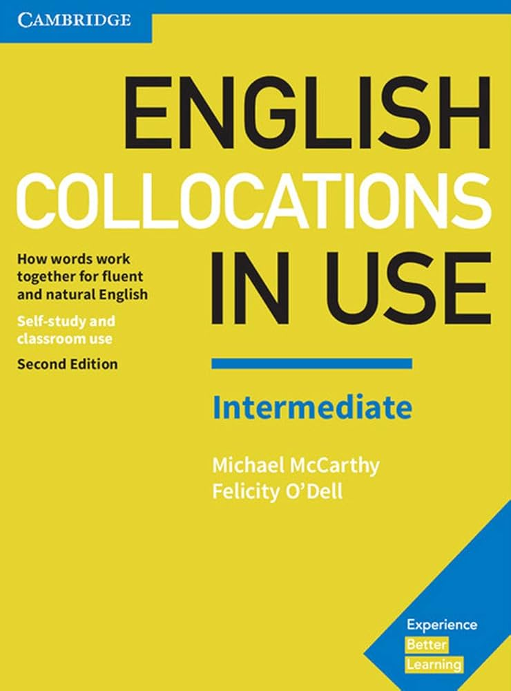
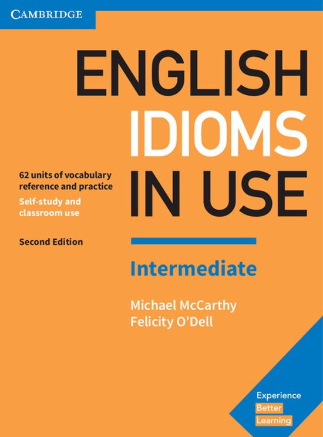
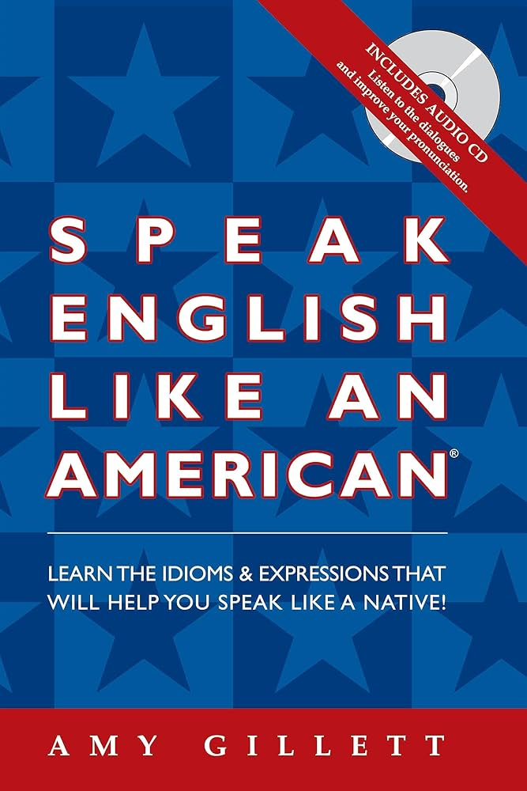
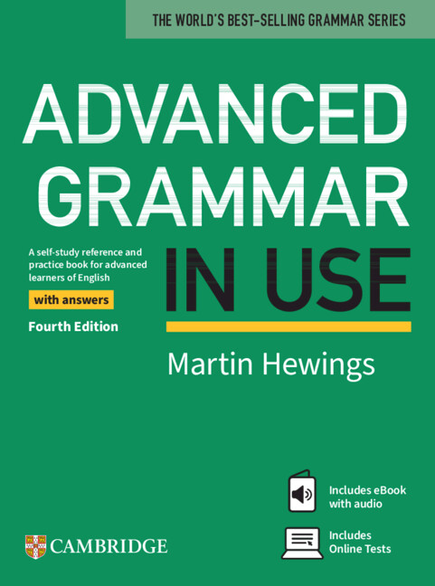
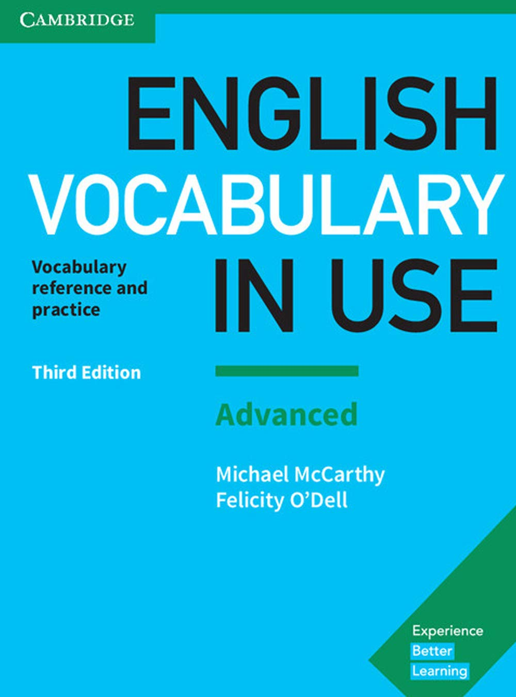
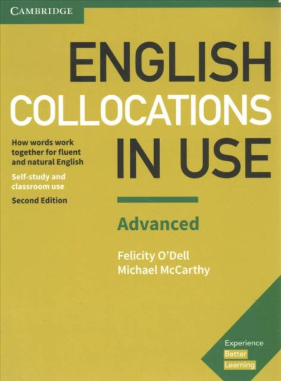
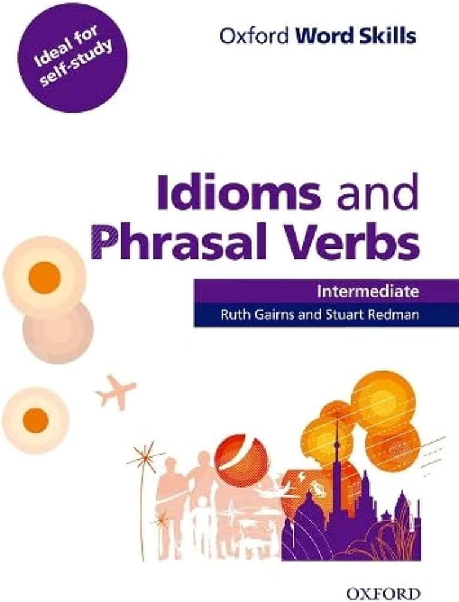
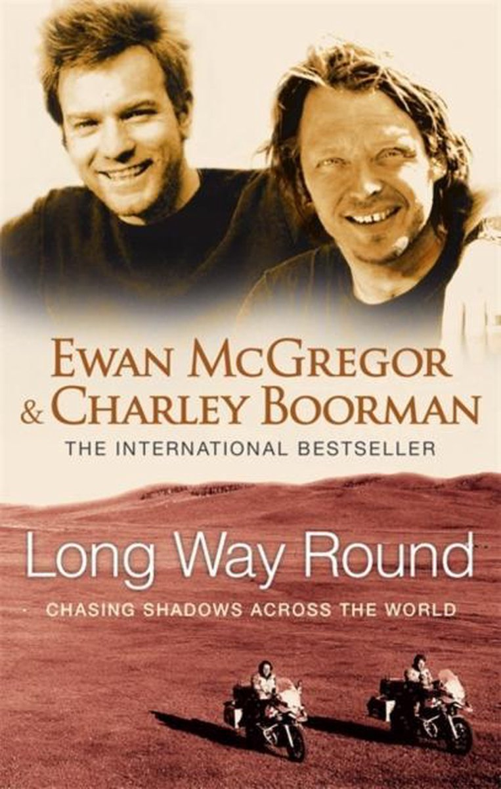

<div align="center">

# 📚 English Studying Journey

### Made by a Brazilian 🇧🇷

[](https://github.com/features/copilot)
[](https://chat.openai.com/)
[](https://claude.ai/)
[](https://www.perplexity.ai/)


</div>

---

## 📑 Table of Contents
- [📚 English Studying Journey](#-english-studying-journey)
    - [Made by a Brazilian 🇧🇷](#made-by-a-brazilian-)
  - [📑 Table of Contents](#-table-of-contents)
  - [🎯 About This Repository](#-about-this-repository)
  - [🧑‍🎓 Starting Level](#-starting-level)
  - [📚 Currently Studying](#-currently-studying)
    - [📖 Book](#-book)
    - [🎓 Online Course](#-online-course)
  - [🛠️ Tools \& Resources](#️-tools--resources)
    - [AI Assistants](#ai-assistants)
    - [Traditional Resources](#traditional-resources)
  - [📚 Book Study Plan](#-book-study-plan)
    - [Phase 1: Foundation (Current)](#phase-1-foundation-current)
    - [Phase 2: Building](#phase-2-building)
    - [Phase 3: Advanced](#phase-3-advanced)
  - [� Reading for Pleasure](#-reading-for-pleasure)
    - [Currently Reading](#currently-reading)
  - [�📁 Repository Structure](#-repository-structure)
  - [🎓 Resources](#-resources)
    - [Online Courses](#online-courses)
      - [My Experience](#my-experience)
  - [💡 Study Approach](#-study-approach)
  - [📊 Current Skills Proficiency](#-current-skills-proficiency)
  - [⚠️ Important Note](#️-important-note)
  - [❓ Frequently Asked Questions](#-frequently-asked-questions)
  - [🤝 Contributing](#-contributing)
  - [📜 License](#-license)

---

Welcome to my English learning repository! This is where I document my journey from B2 to advanced English proficiency, track my progress, and organize all the resources that help me along the way.

## 🎯 About This Repository

This repository serves as:
- 📖 A comprehensive documentation of my English learning journey
- 🗂️ A centralized hub for resources, links, and study materials

## 🧑‍🎓 Starting Level

- **Starting Point:** B2 (Upper-Intermediate)
- **Start Date:** Late 2025
- **Goal:** Achieve fluency and score 6.5-7.0 on IELTS for international CS program applications
- **Native Language:** Portuguese (PT-BR)

## 📚 Currently Studying

<div align="center">

### 📖 Book
**English Grammar in Use** (Intermediate)  

### 🎓 Online Course
**Linguapolis - Online Conversation Practice** (C1+)  
📅 Started: November 18, 2025 | 🗣️ Focus: Speaking & Feedback

</div>

---

## 🛠️ Tools & Resources

### AI Assistants
I leverage various AI tools to enhance my learning experience:

- **GitHub Copilot** - Code-based English practice and technical documentation
- **ChatGPT** - Vocabulary learning
- **Perplexity** - Research, answering questions and finding quality resources

### Traditional Resources
- 📚 Books (Cambridge English series and more)
- 🎥 YouTube videos and channels
- 🎧 Podcasts and audiobooks
- 📰 Articles and blogs
- 📱 Social media content creators
- 🎬 Movies, series, and animes

> ⚠️ **Social Media Warning:** Not all content on social media is trustworthy. Some videos spread false information, teach incorrect lessons, or present linguistic prejudice disguised as educational content. Others may be incomplete or misleading. Always verify information by doing your own research or consulting AI tools. That said, English learning content creators on social media can be incredibly helpful when used critically.

## 📚 Book Study Plan

> **Last Updated:** December 10, 2025

Based on my current B2 level, I've created a structured learning path through the Cambridge English series and complementary materials.

### Phase 1: Foundation (Current)
*Building solid intermediate skills and expanding vocabulary.*

| Cover | Book Title | Status |
|-------|-----------|--------|
|  | **English Grammar in Use** (Intermediate) | 🔄 In Progress |
|  | **English Phrasal Verbs in Use** (Intermediate) | ⏸️ Not Started |
|  | **English Vocabulary in Use** (Upper-Intermediate) | ⏸️ Not Started |

---

### Phase 2: Building
*Developing natural English expression and understanding context.*

| Cover | Book Title | Status |
|-------|-----------|--------|
|  | **English Phrasal Verbs in Use** (Advanced) | ⏸️ Not Started |
|  | **English Collocations in Use** (Intermediate) | ⏸️ Not Started |
|  | **English Idioms in Use** (Intermediate) | ⏸️ Not Started |
|  | **Speak English Like an American** | ⏸️ Not Started |

---

### Phase 3: Advanced
*Mastering advanced structures and native-like expression.*

| Cover | Book Title | Status |
|-------|-----------|--------|
|  | **Advanced Grammar in Use** | ⏸️ Not Started |
|  | **English Vocabulary in Use** (Advanced) | ⏸️ Not Started |
|  | **English Collocations in Use** (Advanced) | ⏸️ Not Started |
|  | **English Idioms in Use** (Advanced) | ⏸️ Not Started |
|  | **Oxford Work Skills - Idioms and Phrasal Verbs** (Intermediate to Advanced) | ⏸️ Not Started |

## � Reading for Pleasure

Beyond textbooks, I also read books for enjoyment to improve my English naturally. This includes novels, memoirs, and non-fiction on topics I love.

> ⚠️ **Lesson Learned:** I once made the mistake of starting with philosophy books (Stoicism). Result? 40+ new words per chapter — completely overwhelming! Now I choose books with accessible vocabulary that I can actually learn from without burning out.

### Currently Reading

| Cover | Title | Author | Genre |
|-------|-------|--------|-------|
|  | **Long Way Round** | Ewan McGregor & Charley Boorman | Travel / Motorcycle Adventure |

📚 **[View Full Reading Tracker →](./reading/README.md)**

## �📁 Repository Structure

```
english-studying/
├── 🎯 prompts/                       # AI prompts for English learning
├── 📝 exercises/                     # Grammar practice exercises
│   └── english-grammar-in-use/       # Organized by book
│       ├── for-since-when-how-long/  # Organized by topic
│       └── past-perfect/             # Past Perfect exercises├── 📖 reading/                       # Reading tracker for leisure books└── 🎨 media/                         # Images, logos, and visual assets
```

> **Note:** Book notes are kept privately in Samsung Notes on my tablet. Additional practice exercises are available in the `exercises/` folder as LaTeX files organized by book and topic that can be compiled into PDFs.

## 🎓 Resources

### Online Courses

<details open>
<summary><b>Online Conversation Practice</b> - Linguapolis, University of Antwerp</summary>

<br>

<div align="center">
  
</div>

<br>

**Institution:** [Linguapolis - University of Antwerp](https://www.uantwerpen.be/en/centres/linguapolis/)  
**Status:** 🔄 On-going  
**Started:** November 18, 2025  
**Level:** C1+

#### My Experience

The classes are well-structured and cover a good amount of content. You're required to speak during every session—not excessively, but enough to ensure active participation. The course offers a variety of group and individual dynamics, and the tutor consistently ensures everyone gets speaking practice.

**Most Valuable Aspect:** The detailed feedback materials sent by the teacher one or two days after each session. These documents highlight what students did well and provide corrections for mistakes made during class. I've learned a significant amount of vocabulary through studying and reviewing these feedback materials.

**Key Takeaways:**
- Active speaking practice in every session
- Diverse group and individual activities
- High-quality, detailed feedback after each class
- Excellent vocabulary expansion through review materials

🔗 [Course Information](https://www.uantwerpen.be/en/centres/linguapolis/online-conversation-practice/)

</details>

---

## 💡 Study Approach

My learning philosophy:
- **Immersion:** Daily exposure to English through multiple channels
- **Active Practice:** Writing, speaking, and applying what I learn
- **AI-Enhanced:** Using technology to accelerate learning while maintaining authentic practice
- **Structured + Flexible:** Following a book plan while adapting to real-world needs
- **English-First:** All materials, notes, and practice in English

## 📊 Current Skills Proficiency
- 📖 **Reading:** C1 (Advanced)
- ✍️ **Writing:** B2 (Upper-Intermediate)
- 🎧 **Listening:** B2 (Upper-Intermediate)
- 🗣️ **Speaking:** B1 (Intermediate)

---

## ⚠️ Important Note

**This repository is highly personal and individualized.** The content, structure, and study plan are tailored to:
- My current English level (B2) as of late 2025
- My specific goals (IELTS preparation, international applications)
- My learning style and background
- My timeline and priorities

While you're welcome to explore and get inspired, keep in mind that your learning path should be customized to your own needs, level, and objectives.

## ❓ Frequently Asked Questions

<details>
<summary><b>Why these specific books?</b></summary>

<br>

The Cambridge "English in Use" series is widely regarded as one of the best structured learning paths for self-study. Each book focuses on a specific skill (grammar, vocabulary, phrasal verbs, etc.) and provides:
- Clear explanations with examples
- Progressive difficulty levels
- Self-study friendly format
- Answer keys for independent learning
- Proven track record with millions of learners worldwide

I chose this progression based on my current B2 level and recommendations from language learning communities.

</details>

<details>
<summary><b>Can I use your study plan?</b></summary>

<br>

Absolutely! However, keep in mind this plan is designed for someone **starting at B2 level**. If you're at a different level:
- **A2-B1:** Start with Elementary/Pre-Intermediate versions of the Cambridge books
- **C1+:** Jump directly to Advanced books or focus on specialized areas

The key is to **assess your current level** first and adjust accordingly!

</details>

<details>
<summary><b>How do you stay motivated?</b></summary>

<br>

Several strategies keep me going:
- 🎯 **Clear goal:** Applying to international programs require strong English
- ✈️ **Real-world practice:** I travel abroad frequently, which gives me constant contact with different people and cultures. These experiences already push me to use English extensively, and beyond studying abroad, I'm focused on improving my language skills to make these interactions even more meaningful and enriching
- 📈 **Visible progress:** This repository tracks my journey publicly
- 🤖 **AI tools:** Make learning more interactive and personalized

</details>

---

## 🤝 Contributing

This is a personal learning repository, but if you have suggestions for resources or want to share your own learning experience, feel free to open an issue!

## 📜 License

This repository is for educational purposes. All book materials referenced are copyrighted by their respective publishers.

---

**Last Updated:** December 2025  
**Status:** 🚀 Active Learning

<div align="center">

[](https://git.io/typing-svg)

</div>
