

# 📚 English Studying Journey

### Made by a Brazilian 🇧🇷

---

Welcome to my English learning repository! This is where I document my journey from B2 to advanced English proficiency, track my progress, and organize all the resources that help me along the way.

## 🎯 About This Repository

This repository serves as:
- 📖 A comprehensive documentation of my English learning journey
- 🗂️ A centralized hub for resources, links, and study materials

## 🧑‍🎓 Starting Level

- **Starting Point:** B2 (Upper-Intermediate)
- **Start Date:** Late 2025

## 🎯 Currently
- **Goal:** Improve all fields — especially Writing and Speaking — to sound natural and fluent
- **IELTS Result:** 🎉 **8.0 Overall (C1)** — Target exceeded on first attempt!

## 📚 Currently Studying

### 📖 Book
**English Grammar in Use** (Intermediate)  

---

## 🎯 IELTS Journey

 

  

 

<b>Attempt #1</b>

> **Target Score:** 6.5 - 7.0 (Academic) | **Purpose:** International bachelor program applications

| Date | Format | Listening | Reading | Writing | Speaking | Overall | CEFR | Notes |
|:----:|:------:|:---------:|:-------:|:-------:|:--------:|:-------:|:----:|:------|
| Feb 11-12, 2026 | Online Academic Test (British Council) | **8.5** | **8.5** | **7.5** | **7.5** | **8.0** | **C1** | First attempt. Target exceeded! ✅ |

---

## 🛠️ Tools & Resources

### AI Assistants
I leverage AI tools to enhance my learning experience:

- **GitHub Copilot** - Code-based English practice, technical documentation, and repository automation
- **Claude** - Vocabulary research, writing feedback, and AI-powered assistance. Also handles vocabulary ingestion into the Obsidian vault — when a sizeable list of new words has been collected in the to-do list, Claude researches each word and creates the vocabulary cards following the vault's format and structure

### Traditional Resources
- 📚 Books (Cambridge English series and more)
- 🎥 YouTube videos and channels
- 🎧 Podcasts and audiobooks
- 📰 Articles and blogs
- 📱 Social media content creators
- 🎬 Movies, series, and animes

> ⚠️ **Social Media Warning:** Not all content on social media is trustworthy. Some videos spread false information, teach incorrect lessons, or present linguistic prejudice disguised as educational content. Others may be incomplete or misleading. Always verify information by doing your own research or consulting AI tools. That said, English learning content creators on social media can be incredibly helpful when used critically.

## 📚 Book Study Plan

> **Last Updated:** March 2026

A structured learning path through the Cambridge English series and complementary materials, progressing from intermediate to advanced proficiency.

### Phase 1: Foundation (Current)
*Building solid intermediate skills and expanding vocabulary.*

| Cover | Book Title | Status |
|-------|-----------|--------|
| 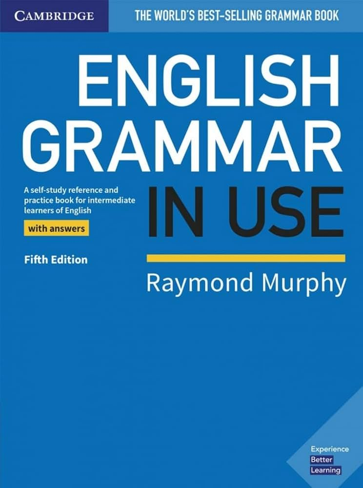 | **English Grammar in Use** (Intermediate) | 🔄 In Progress |
| 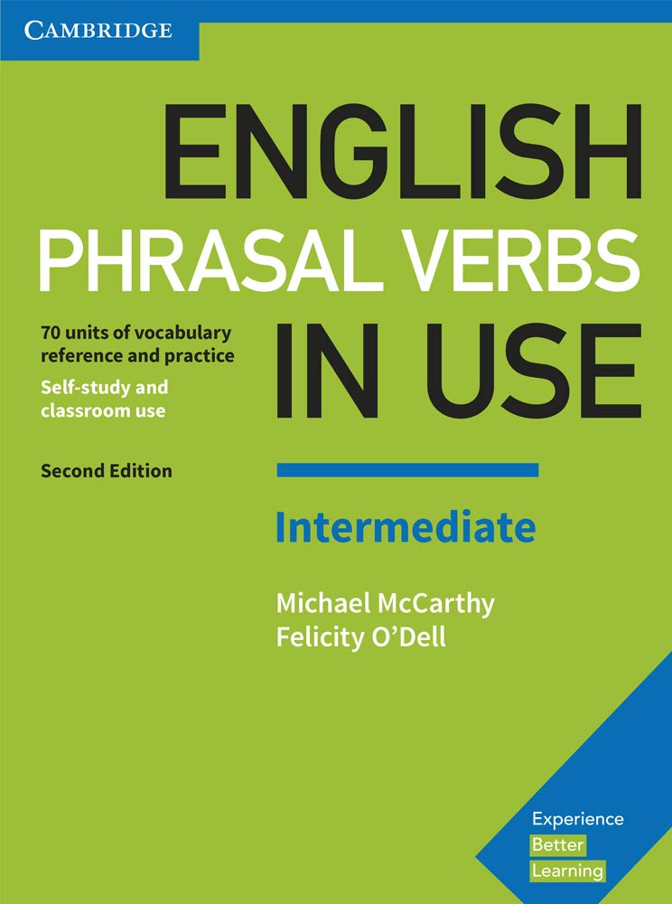 | **English Phrasal Verbs in Use** (Intermediate) | ⏸️ Not Started |
| 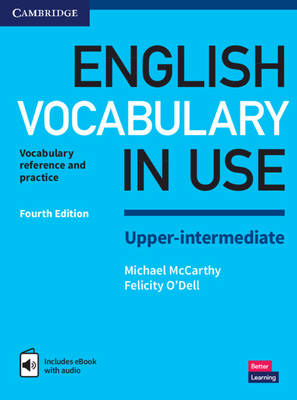 | **English Vocabulary in Use** (Upper-Intermediate) | ⏸️ Not Started |

---

### Phase 2: Building
*Developing natural English expression and understanding context.*

| Cover | Book Title | Status |
|-------|-----------|--------|
| 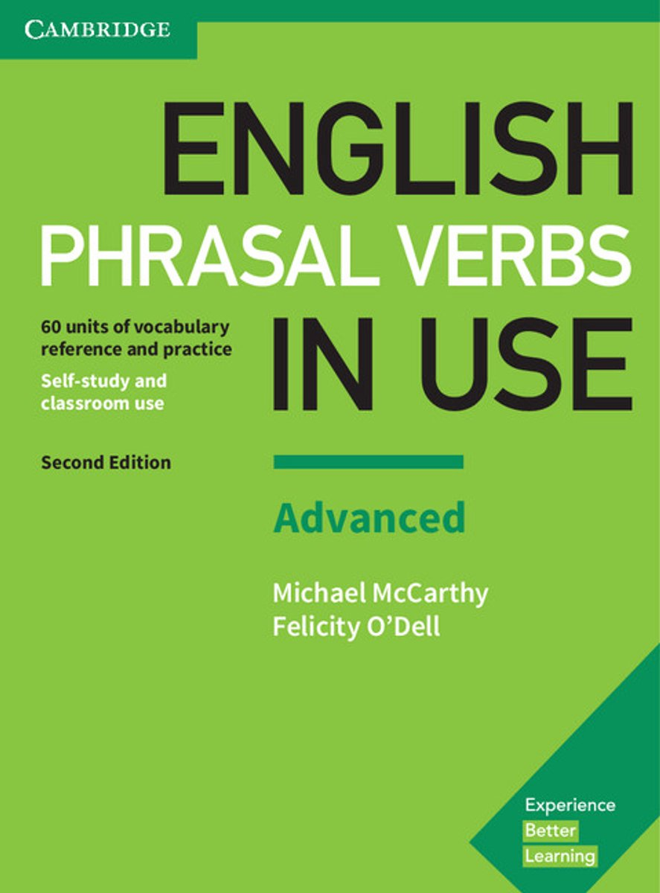 | **English Phrasal Verbs in Use** (Advanced) | ⏸️ Not Started |
| 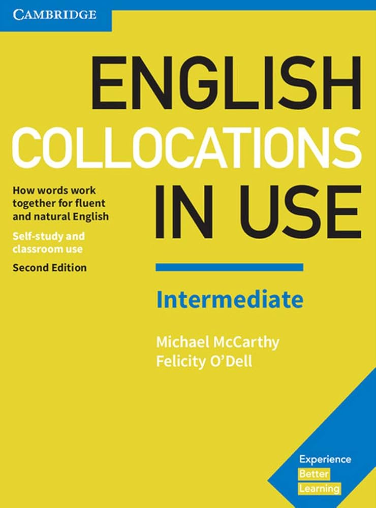 | **English Collocations in Use** (Intermediate) | ⏸️ Not Started |
| 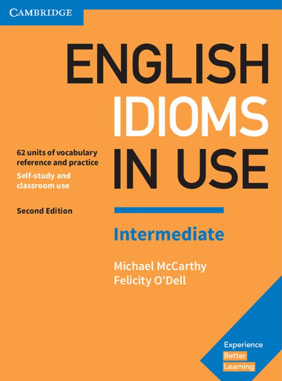 | **English Idioms in Use** (Intermediate) | ⏸️ Not Started |
| 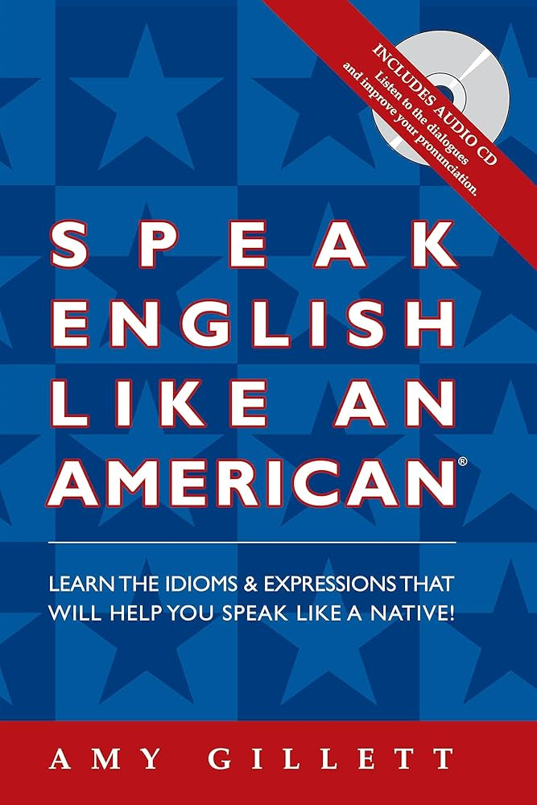 | **Speak English Like an American** | ⏸️ Not Started |

---

### Phase 3: Advanced
*Mastering advanced structures and native-like expression.*

| Cover | Book Title | Status |
|-------|-----------|--------|
| 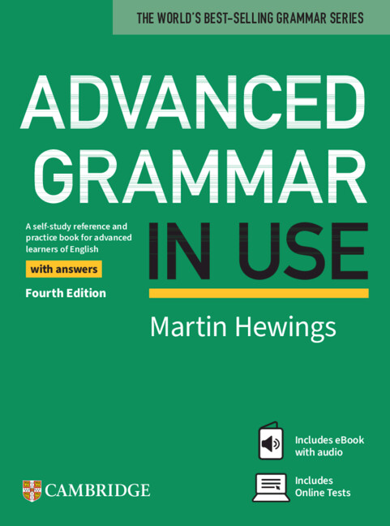 | **Advanced Grammar in Use** | ⏸️ Not Started |
| 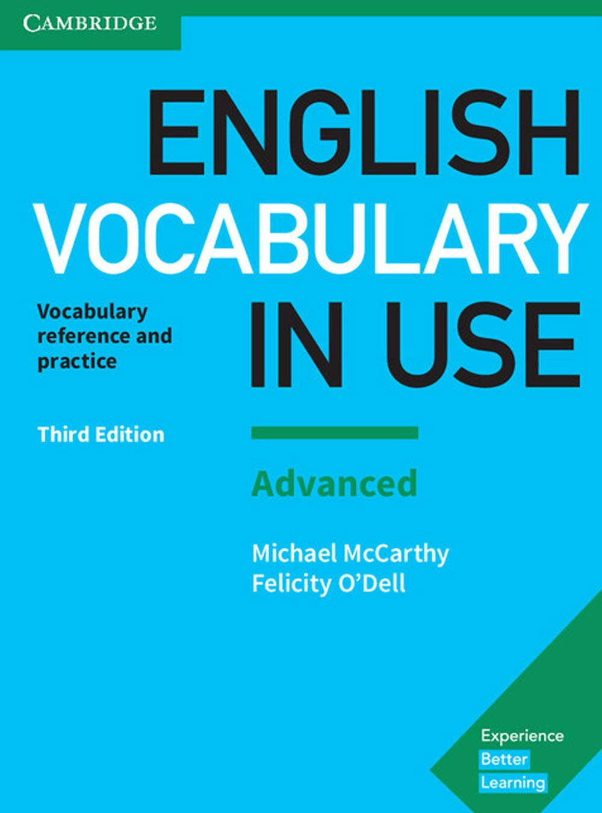 | **English Vocabulary in Use** (Advanced) | ⏸️ Not Started |
| 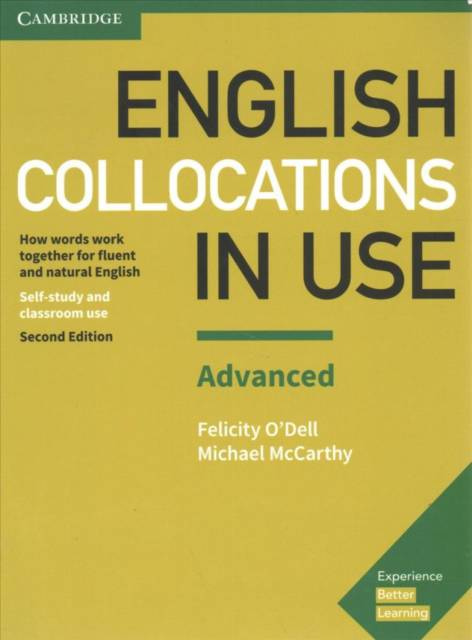 | **English Collocations in Use** (Advanced) | ⏸️ Not Started |
|  | **English Idioms in Use** (Advanced) | ⏸️ Not Started |
| 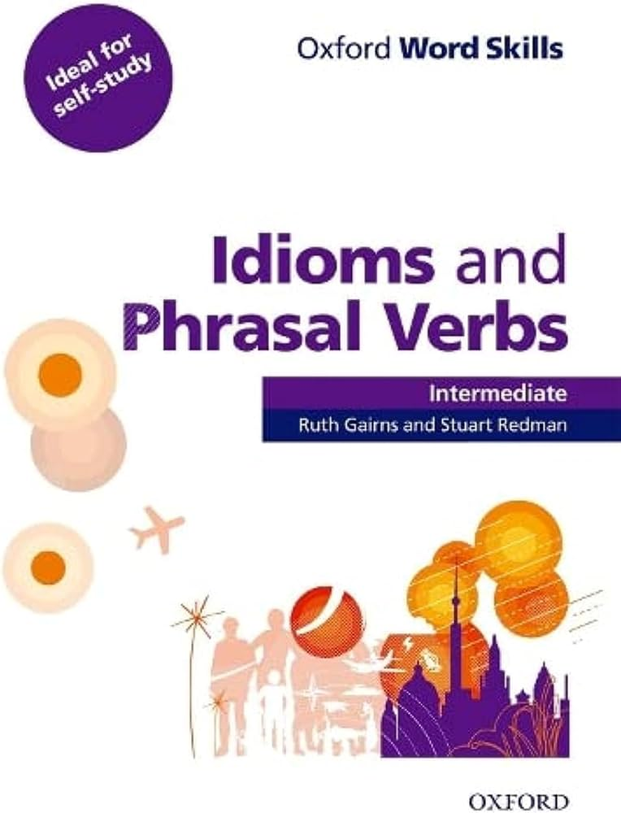 | **Oxford Work Skills - Idioms and Phrasal Verbs** (Intermediate to Advanced) | ⏸️ Not Started |

---

> **Note:** Book notes and annotations are kept privately in **Samsung Notes** on my tablet for convenience during study sessions. Additional practice exercises are available in the [`exercises/` folder](./exercises/) as LaTeX files organized by book and topic.

## 📖 Reading for Pleasure

Beyond textbooks, I also read books for enjoyment to improve my English naturally. This includes novels, memoirs, and non-fiction on topics I love.

> ⚠️ **Lesson Learned:** I once made the mistake of starting with philosophy books (Stoicism). Result? 40+ new words per chapter — completely overwhelming! Now I choose books with accessible vocabulary that I can actually learn from without burning out.

### Currently Reading

| Cover | Title | Author | Genre |
|-------|-------|--------|-------|
| 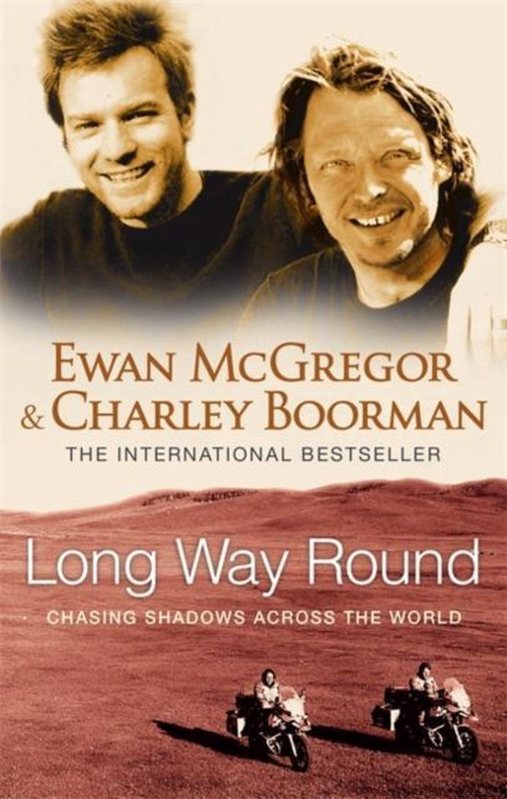 | **Long Way Round: Chasing Shadows Across the World** | Ewan McGregor & Charley Boorman | Travel / Motorcycle Adventure |

📚 **[View Full Reading Tracker →](./reading/README.md)**

## 🧠 Obsidian Vocabulary Vault

This repository includes a fully-featured **Obsidian vault** for tracking vocabulary learned from anime, manga, series, and other media. Located in `obsidian-vaults/english-vocabulary/`.

**Features:**
- 📇 **Vocabulary Cards** — Detailed word cards with definitions, word families, collocations, etymology, usage notes, and Portuguese translations
- 📊 **Interactive Dashboard** — Homepage with DataviewJS-powered statistics, recent words, and paginated word lists per media source
- 📈 **Learning Progress Charts** — Visual tracking of vocabulary growth over time for each media source
- 🏷️ **Media-Based Organization** — Words organized by source material (Dragon Ball Z, F1, Peaky Blinders, Jujutsu Kaisen Modulo)
- 🎨 **Custom Theme** — Dracula dark scheme with media-specific accent colors and custom CSS
- 📝 **Blog Section** — Articles exploring interesting English language topics
- 🧪 **Vocabulary Exercises** — Practice sets with LaTeX-generated PDFs
- 🤖 **AI Prompt Integration** — Built-in vocabulary learning prompt for use with AI assistants

> **To use the vault:** Open the `obsidian-vaults/english-vocabulary/` folder as a vault in [Obsidian](https://obsidian.md/). The vault includes all plugins, theme settings, and CSS snippets pre-configured.

## 🎓 Resources

### Online Courses

<b>Online Conversation Practice</b> - Linguapolis, University of Antwerp

 

  

 

**Institution:** [Linguapolis - University of Antwerp](https://www.uantwerpen.be/en/centres/linguapolis/)  
**Status:** ✅ Completed  
**Started:** November 18, 2025  
**Finished:** February 3, 2026  
**Total Sessions:** 10  
**Level:** C1+

#### My Experience

The classes are well-structured and cover a good amount of content. You're required to speak during every session—not excessively, but enough to ensure active participation. The course offers a variety of group and individual dynamics, and the tutor consistently ensures everyone gets speaking practice.

**Most Valuable Aspect:** The detailed feedback materials sent by the teacher one or two days after each session. These documents highlight what students did well and provide corrections for mistakes made during class. I've learned a significant amount of vocabulary through studying and reviewing these feedback materials.

**Key Takeaways:**
- Active speaking practice in every session
- Diverse group and individual activities
- High-quality, detailed feedback after each class
- Excellent vocabulary expansion through review materials

🔗 [Course Information](https://www.uantwerpen.be/en/centres/linguapolis/online-conversation-practice/)

---

## 💡 Study Approach

My learning philosophy:
- **Immersion:** Daily exposure to English through multiple channels
- **Active Practice:** Writing, speaking, and applying what I learn
- **AI-Enhanced:** Using technology to accelerate learning while maintaining authentic practice
- **Structured + Flexible:** Following a book plan while adapting to real-world needs
- **English-First:** All materials, notes, and practice in English

## 📊 Current Skills Proficiency

> Based on official IELTS Academic results (Feb 2026) — Overall Band: **8.0 (C1)**

- 🎧 **Listening:** Band 8.5 — C1/C2 (Expert)
- 📖 **Reading:** Band 8.5 — C1/C2 (Expert)
- ✍️ **Writing:** Band 7.5 — C1 (Advanced)
- 🗣️ **Speaking:** Band 7.5 — C1 (Advanced)

---

## ⚠️ Important Note

**This repository is highly personal and individualized.** The content, structure, and study plan are tailored to:
- My English journey from B2 (late 2025) to C1 (Feb 2026, IELTS 8.0)
- My specific goals (IELTS preparation, international applications)
- My learning style and background
- My timeline and priorities

While you're welcome to explore and get inspired, keep in mind that your learning path should be customized to your own needs, level, and objectives.

## ❓ Frequently Asked Questions

<b>Why these specific books?</b>

 

The Cambridge "English in Use" series is widely regarded as one of the best structured learning paths for self-study. Each book focuses on a specific skill (grammar, vocabulary, phrasal verbs, etc.) and provides:
- Clear explanations with examples
- Progressive difficulty levels
- Self-study friendly format
- Answer keys for independent learning
- Proven track record with millions of learners worldwide

I chose this progression based on recommendations from language learning communities and a well-established progression from intermediate to advanced.

<b>Can I use your study plan?</b>

 

Absolutely! However, keep in mind this plan is designed for someone **starting at B2 level**. If you're at a different level:
- **A2-B1:** Start with Elementary/Pre-Intermediate versions of the Cambridge books
- **C1+:** Jump directly to Advanced books or focus on specialized areas

The key is to **assess your current level** first and adjust accordingly!

<b>How do you stay motivated?</b>

 

Several strategies keep me going:
- 🎯 **Clear goal:** Applying to international programs require strong English
- ✈️ **Real-world practice:** I travel abroad frequently, which gives me constant contact with different people and cultures. These experiences already push me to use English extensively, and beyond studying abroad, I'm focused on improving my language skills to make these interactions even more meaningful and enriching
- 📈 **Visible progress:** This repository tracks my journey publicly
- 🤖 **AI tools:** Make learning more interactive and personalized

---

## 📋 To-Do

- [ ] Move IELTS preparation materials into the `obsidian-vaults/ielts-prep/` vault

---

## 🤝 Contributing

This is a personal learning repository, but if you have suggestions for resources or want to share your own learning experience, feel free to open an issue!

## 📜 License

This repository is for educational purposes. All book materials referenced are copyrighted by their respective publishers.

---

**Last Updated:** March 2026  
**Status:** 🚀 Active Learning

